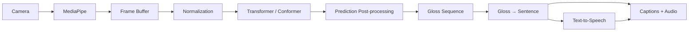

# SilentSign — Sign-to-Speech Architecture

## 1. Owner

**Primary owner: Swayam**

This pipeline converts ISL signing captured through the camera into a recognized gloss sequence, natural-language text, and spoken audio.

---

## 2. End-to-End Flow



---

## 3. Input

Browser webcam or phone camera.

Runtime objective:

```text
Camera frames
   ↓
MediaPipe
   ↓
Left hand + right hand + pose landmarks
   ↓
Numerical landmark sequence
```

The recognition model operates on landmarks, not raw RGB frames.

---

## 4. Frontend Layer

```text
frontend/src/features/sign-input/
├── components/
│   ├── CameraFeed.tsx
│   ├── LandmarkOverlay.tsx
│   ├── SignStatus.tsx
│   └── ConfidenceMeter.tsx
├── hooks/
│   ├── useCamera.ts
│   └── useMediaPipe.ts
├── services/
│   ├── landmarkExtractor.ts
│   └── frameBuffer.ts
└── types/
    └── sign.types.ts
```

Responsibilities:

- `useCamera.ts`: permissions, stream lifecycle, cleanup
- `useMediaPipe.ts`: MediaPipe setup and frame processing
- `landmarkExtractor.ts`: convert detections into deterministic arrays
- `frameBuffer.ts`: maintain 30–60 frame windows

---

## 5. Canonical Landmark Contract

```ts
export type Point3D = {
  x: number | null;
  y: number | null;
  z?: number | null;
};

export type LandmarkFrame = {
  timestamp: number;
  leftHand: Point3D[];
  rightHand: Point3D[];
  pose: Point3D[];
};
```

The feature order must stay identical across:
- offline extraction
- preprocessing
- training
- validation
- live inference

---

## 6. Preprocessing

```text
ml/sign-recognition/src/preprocessing/
├── normalize.py
├── missing_landmarks.py
├── sequence.py
└── augmentation.py
```

Pipeline:

```text
Raw landmarks
   ↓
Missing-landmark handling
   ↓
Center/scale normalization
   ↓
Pad or trim sequence
   ↓
Model tensor
```

Normalization must use the same algorithm at training and runtime.

---

## 7. Dataset Preparation

Store source datasets outside Git. Keep only manifests and approved tiny samples in the repo.

Mandatory split rule:

```text
Train       → signer group A
Validation  → signer group B
Test        → completely held-out signer(s)
```

The same person must not leak across train and test.

---

## 8. Model

Suggested initial structure:

```text
Landmark sequence
      ↓
Input projection
      ↓
Positional encoding
      ↓
Transformer encoder
      ↓
Temporal pooling
      ↓
Classifier
      ↓
Gloss probabilities
```

Output example:

```json
{
  "PAIN": 0.91,
  "HELP": 0.04,
  "DOCTOR": 0.02
}
```

---

## 9. Prediction Post-processing

Live inference should include:
- confidence threshold
- smoothing
- duplicate suppression
- cooldown/debounce
- UNKNOWN rejection
- optional top-3 guesses
- sign start/end handling

Example:

```text
Raw:
PAIN
PAIN
PAIN
HELP
PAIN

Final:
PAIN
```

---

## 10. Sign Segmentation

MVP:
- explicit `Done` button

Improved:
- detect movement start
- detect idle/rest
- terminate sequence after pause

Do not block the MVP on perfect automatic segmentation.

---

## 11. Prediction Contract

```json
{
  "type": "sign_prediction",
  "gloss": "PAIN",
  "confidence": 0.91,
  "timestamp": 1791107414,
  "model_version": "0.1.0",
  "vocabulary_version": "0.1.0"
}
```

Low-confidence prediction:

```json
{
  "type": "sign_prediction",
  "gloss": "UNKNOWN",
  "confidence": 0.42,
  "alternatives": [
    {"gloss": "PAIN", "confidence": 0.42},
    {"gloss": "HELP", "confidence": 0.31},
    {"gloss": "SICK", "confidence": 0.14}
  ]
}
```

---

## 12. Gloss Sequence Builder

Example:

```text
ME
STOMACH
PAIN
```

becomes:

```json
{
  "glosses": ["ME", "STOMACH", "PAIN"]
}
```

Duplicate suppression prevents repeated emissions from overlapping frame windows.

---

## 13. Gloss → Natural Sentence

Backend location:

```text
backend/app/services/language/gloss_to_text.py
```

Example input:

```json
{
  "context": "hospital",
  "glosses": ["ME", "STOMACH", "PAIN"]
}
```

Example output:

```json
{
  "text": "I have a stomach ache."
}
```

Guardrails:
- preserve meaning
- do not add unsupported medical facts
- keep raw glosses available
- do not hide uncertain recognition

---

## 14. Text-to-Speech

Backend location:

```text
backend/app/services/tts/tts_service.py
```

Responsibilities:
- generate spoken output
- return audio/stream
- support English first
- support Hindi later if time allows

Fallback: if TTS fails, show captions only.

---

## 15. ONNX Export

```text
PyTorch model
   ↓
ONNX export
   ↓
runtime inference
```

Export only after:
- feature ordering is frozen
- preprocessing is frozen
- vocabulary order is frozen
- evaluation passes

---

## 16. Error Handling

| Condition | Behaviour |
|---|---|
| Camera blocked | Show permission instructions |
| No hands | Ask user to show hands |
| Poor framing | Ask user to adjust |
| Low confidence | UNKNOWN / top-3 |
| Model unavailable | Keep camera alive; disable prediction |
| LLM unavailable | Show raw glosses |
| TTS unavailable | Show text only |

---

## 17. Phase Mapping

**Phase 1:** Camera, MediaPipe, overlay, frame buffer  
**Phase 2:** extraction, cleaning, normalization, signer-wise split  
**Phase 3:** Transformer/Conformer training and evaluation  
**Phase 4:** live inference, smoothing, UNKNOWN, segmentation  
**Phase 5:** gloss sequence → LLM → TTS  
**Phase 6:** ONNX/runtime optimization and final integration

---

## 18. Definition of Done

```text
Unseen signer
   ↓
known sign
   ↓
camera landmarks
   ↓
correct gloss
   ↓
natural sentence
   ↓
caption + spoken audio
```

The pipeline must also fail safely for unknown or poor-quality input.
