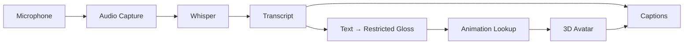

# SilentSign — Speech-to-Sign Architecture

## 1. Owner

**Primary owner: Rishi**

This pipeline converts spoken language into text, maps the text to a restricted ISL gloss sequence, and plays corresponding sign animations through a 3D avatar.

---

## 2. End-to-End Flow



---

## 3. Frontend Structure

```text
frontend/src/features/
├── speech-input/
│   ├── components/
│   │   ├── MicButton.tsx
│   │   ├── AudioStatus.tsx
│   │   └── Waveform.tsx
│   ├── hooks/
│   │   └── useMicrophone.ts
│   ├── services/
│   │   └── audioRecorder.ts
│   ├── types/
│   │   └── speech.types.ts
│   └── index.ts
│
└── avatar/
    ├── components/
    │   ├── SignAvatar.tsx
    │   └── AvatarControls.tsx
    ├── hooks/
    │   └── useAvatar.ts
    ├── services/
    │   ├── animationPlayer.ts
    │   ├── animationLoader.ts
    │   └── animationBlender.ts
    ├── types/
    │   └── avatar.types.ts
    └── index.ts
```

---

## 4. Microphone Layer

Responsibilities:
- request microphone permission
- start/stop recording
- display status
- handle permission denial
- detect no-input cases
- send audio to backend
- release tracks after use

Example state:

```ts
type MicrophoneState =
  | "idle"
  | "requesting"
  | "ready"
  | "recording"
  | "processing"
  | "error";
```

---

## 5. Audio Contract

Example metadata:

```json
{
  "language": "en",
  "context": "hospital",
  "sampleRate": 16000
}
```

The frontend owns capture. The backend owns transcription.

---

## 6. Whisper Service

```text
backend/app/services/speech/
├── whisper_service.py
└── audio_processor.py
```

Flow:

```text
Audio payload
   ↓
validation
   ↓
preprocessing
   ↓
Whisper
   ↓
transcript
```

Example:

```json
{
  "text": "Where does it hurt?",
  "language": "en",
  "confidence": 0.93
}
```

Error cases:
- no speech
- very short audio
- noisy input
- corrupt format
- service unavailable

Never invent a transcript if ASR fails.

---

## 7. Text → ISL Gloss

```text
backend/app/services/language/text_to_gloss.py
```

The LLM must be restricted to the supported vocabulary.

Input example:

```json
{
  "text": "Where does it hurt?",
  "context": "hospital",
  "allowed_glosses": [
    "WHERE",
    "PAIN",
    "DOCTOR",
    "MEDICINE",
    "YES",
    "NO"
  ]
}
```

Output:

```json
{
  "glosses": ["WHERE", "PAIN"],
  "unsupported_words": []
}
```

Never allow the LLM to invent an animation/sign that is not present in the library.

---

## 8. Shared Vocabulary

Consume:

```text
shared/vocabulary/
├── vocabulary.json
├── label_map.json
└── contexts.json
```

The vocabulary is the contract between:
- sign classifier
- language layer
- avatar animation registry

---

## 9. Dataset / Motion Dependency

Rishi can begin with his own verified signs such as:
- PAIN
- DOCTOR
- HELP

At the end of Phase 3 / start of Phase 4, Swayam shares selected reference data for missing shared signs.

Preferred exchange:

```text
Selected reference video
        ↓
clean landmarks / motion
        ↓
avatar animation asset
```

Do not transfer entire multi-GB datasets unless truly required and legally permitted.

---

## 10. Avatar Architecture

Recommended stack:

```text
React
  ↓
React Three Fiber
  ↓
Three.js
  ↓
Rigged GLB avatar
  ↓
Animation clips
```

Suggested assets:

```text
public/
├── models/
│   └── avatar/
│       └── avatar.glb
└── animations/
    ├── PAIN.*
    ├── DOCTOR.*
    └── HELP.*
```

---

## 11. Animation Lookup

Example contract:

```ts
type AnimationRegistry = {
  [gloss: string]: {
    clip: string;
    durationMs?: number;
  };
};
```

Example:

```json
{
  "PAIN": {
    "clip": "/animations/PAIN.glb"
  },
  "DOCTOR": {
    "clip": "/animations/DOCTOR.glb"
  }
}
```

Runtime:

```text
["PAIN", "WHEN"]
   ↓
lookup clips
   ↓
play in sequence
```

---

## 12. Animation Sequencing

Avatar runtime should support:
- sequential playback
- clip transitions/blending
- replay
- slower playback
- caption synchronization
- missing-clip fallback

---

## 13. Missing Sign Fallback

Fallback order:
1. show text/caption
2. offer reliable quick phrase where applicable
3. later add fingerspelling as a stretch feature

Never invent a sign animation.

---

## 14. Caption Synchronization

Example:

```json
{
  "gloss": "PAIN",
  "startMs": 0,
  "endMs": 1100
}
```

The active gloss should be highlighted while the corresponding animation is playing.

---

## 15. Conversation Contract

Example:

```json
{
  "id": "msg-001",
  "source": "hearing-user",
  "inputType": "speech",
  "text": "Where does it hurt?",
  "glosses": ["WHERE", "PAIN"],
  "timestamp": 1791107414
}
```

---

## 16. Backend Responsibilities

```text
backend/app/services/
├── speech/
│   ├── whisper_service.py
│   └── audio_processor.py
└── language/
    └── text_to_gloss.py
```

Backend must:
- validate audio
- run Whisper
- sanitize transcript input
- restrict LLM output to known glosses
- validate returned glosses
- standardize errors
- keep API keys server-side

---

## 17. Phase Mapping

**Phase 1:** mic permission, audio capture, avatar loads, basic animation  
**Phase 2:** Whisper, transcript, retry/error handling  
**Phase 3:** text → gloss, vocabulary restriction, context prompts  
**Phase 4:** animation library, selected dataset sharing, blending, captions  
**Phase 5:** complete speech → text → gloss → avatar  
**Phase 6:** conversation UI, transcript, debug, integration, optional Mode 2

---

## 18. Definition of Done

```text
Hearing user speaks
   ↓
audio captured
   ↓
Whisper transcript
   ↓
supported gloss sequence
   ↓
avatar animation lookup
   ↓
avatar signs sequence
   ↓
captions stay synchronized
```

The pipeline must gracefully handle noisy audio, unsupported words, missing clips, service failures, and microphone permission errors.
