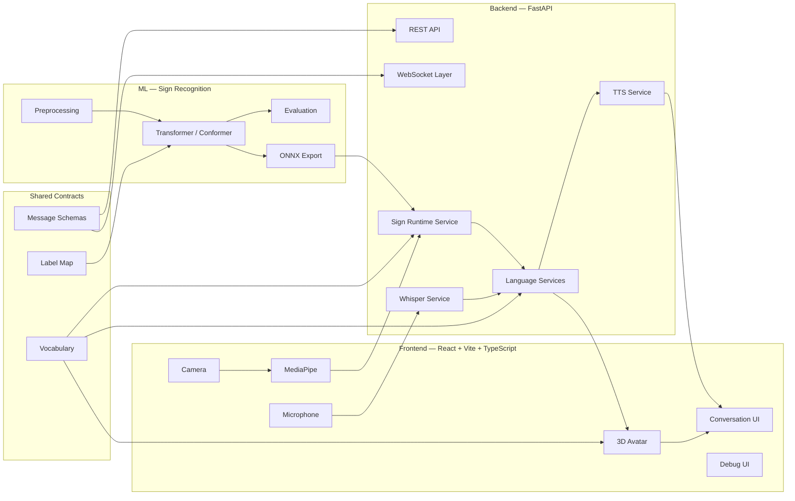

# SilentSign — System Architecture

## 1. Purpose

SilentSign is a two-way Indian Sign Language (ISL) communication system designed for face-to-face conversations first, with remote communication as a later extension.

The application supports two primary directions:

1. **Sign → Text/Speech**
   - A signer performs an ISL sign in front of the camera.
   - Browser-side MediaPipe extracts hand/body landmarks.
   - A sign-recognition model predicts one or more glosses.
   - An LLM converts glosses into a natural-language sentence.
   - The sentence is shown as captions and optionally spoken with TTS.

2. **Speech → Text → Sign Avatar**
   - A hearing user speaks into the microphone.
   - Whisper converts speech into text.
   - An LLM converts the sentence into a restricted ISL gloss sequence.
   - The frontend looks up sign-animation clips.
   - A 3D avatar performs the corresponding signs with captions.

The core MVP is **Mode 1: face-to-face on one device**. Authentication, friends, and full remote chat are not required for the first working version.

---

## 2. High-Level Architecture



---

## 3. Repository Architecture

```text
SilentSign/
├── frontend/                 # React + Vite + TypeScript
├── backend/                  # FastAPI + WebSocket + runtime AI services
├── ml/                       # Dataset processing, training, evaluation, export
├── shared/                   # Vocabulary, label maps, schemas/contracts
├── data/                     # Manifests and local data references
├── docs/                     # Architecture, APIs, phase notes
├── scripts/                  # Setup/automation scripts
└── tests/                    # Cross-service / end-to-end tests
```

### Separation of responsibility

- `frontend/` contains UI, camera, microphone, MediaPipe browser integration, avatar rendering, captions, transcript, and debug visualization.
- `backend/` contains orchestration, Whisper, LLM services, TTS, WebSocket handling, room management, and sign-model runtime loading.
- `ml/` contains offline data preparation, training, validation, evaluation, and model export.
- `shared/` defines contracts used by both Swayam and Rishi and must not drift casually.
- `data/` stores manifests and metadata only. Multi-GB source datasets remain outside Git.

---

## 4. Core Runtime Flows

### Sign → Speech

```text
Camera
  ↓
MediaPipe landmarks
  ↓
Frame buffer
  ↓
Normalization
  ↓
Sign model
  ↓
Gloss prediction
  ↓
Gloss sequence
  ↓
LLM
  ↓
Natural sentence
  ↓
Text + TTS
```

### Speech → Sign

```text
Microphone
  ↓
Whisper
  ↓
Transcript
  ↓
LLM
  ↓
Restricted ISL gloss sequence
  ↓
Animation lookup
  ↓
3D avatar
  ↓
Caption + sign playback
```

---

## 5. Frontend Architecture

```text
frontend/src/
├── app/
├── pages/
├── features/
│   ├── sign-input/
│   ├── speech-input/
│   ├── avatar/
│   ├── conversation/
│   ├── context-mode/
│   ├── debug/
│   └── rooms/
├── components/
├── services/
├── hooks/
├── store/
├── types/
├── constants/
├── config/
└── lib/
```

### Frontend ownership

- **Swayam**: `features/sign-input/`, sign-side debug tools, camera + MediaPipe + frame buffer.
- **Rishi**: `features/speech-input/`, `features/avatar/`, microphone + avatar rendering.
- **Shared**: conversation UI, API/WebSocket client, context modes, app shell, final integration.

---

## 6. Backend Architecture

```text
backend/app/
├── api/
│   └── v1/
├── core/
├── schemas/
├── services/
│   ├── sign_recognition/
│   ├── language/
│   ├── speech/
│   ├── tts/
│   └── rooms/
├── websocket/
├── dependencies/
└── utils/
```

Backend responsibilities:
- request validation
- runtime configuration
- secure environment-variable loading
- sign-model inference
- Whisper transcription
- gloss ↔ natural-language conversion
- text-to-speech
- WebSocket events
- Mode 2 room management
- standard error responses
- logging and debug metrics

---

## 7. ML Architecture

```text
ml/sign-recognition/
├── configs/
├── src/
│   ├── extraction/
│   ├── preprocessing/
│   ├── datasets/
│   ├── models/
│   ├── training/
│   ├── evaluation/
│   ├── inference/
│   └── export/
├── scripts/
├── artifacts/
└── tests/
```

ML lifecycle:

```text
Dataset videos
   ↓
MediaPipe landmark extraction
   ↓
Cleaning / missing-value handling
   ↓
Normalization
   ↓
Fixed-length sequence generation
   ↓
Signer-aware train / validation / test split
   ↓
Transformer / Conformer training
   ↓
Evaluation
   ↓
ONNX export
   ↓
Backend/browser runtime
```

---

## 8. Shared Contracts

Recommended shared files:

```text
shared/
├── vocabulary/
│   ├── vocabulary.json
│   ├── label_map.json
│   └── contexts.json
└── contracts/
    ├── sign-prediction.schema.json
    ├── speech-result.schema.json
    ├── websocket-events.schema.json
    └── conversation-message.schema.json
```

Example:

```json
{
  "gloss": "PAIN",
  "confidence": 0.91,
  "timestamp": 1791107414
}
```

Contract rule: Swayam and Rishi must use the exact same gloss labels.

---

## 9. MVP Boundary

### Must-have
- Live camera
- MediaPipe landmark overlay
- Sign recognition
- Confidence
- Sign start/end handling
- Gloss → sentence
- TTS + captions
- Microphone capture
- Whisper speech recognition
- Text → restricted gloss
- 3D avatar playback
- Conversation transcript
- Clear/reset
- Debug information
- Mode 1

### Later / optional
- Mode 2 room code
- Hindi support
- Fingerspelling
- Login
- Friends/contacts
- unrestricted continuous ISL translation

---

## 10. Reliability Rules

1. Use a fixed known vocabulary.
2. Reject low-confidence predictions.
3. Hold out at least one signer for fair testing.
4. Never split duplicate raw/cropped versions of the same performance across train and test.
5. Do not store large source datasets in Git.
6. Keep API keys and secrets in environment variables.
7. Validate API and WebSocket inputs.
8. Disable production debug output by default.
9. Track model, vocabulary, and preprocessing versions.
10. Preserve graceful fallbacks when AI services fail.

---

## 11. Development Strategy

```text
Phase 0 — Dataset & vocabulary
Phase 1 — Input foundations
Phase 2 — Data/speech preparation
Phase 3 — AI core
Phase 4 — Real-time recognition + avatar
Phase 5 — Complete two-way pipelines
Phase 6 — Integration + final application
```

Build a small end-to-end path early, then expand vocabulary and polish.
